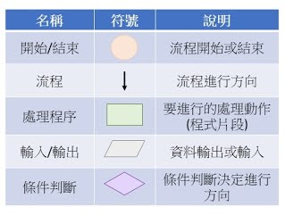
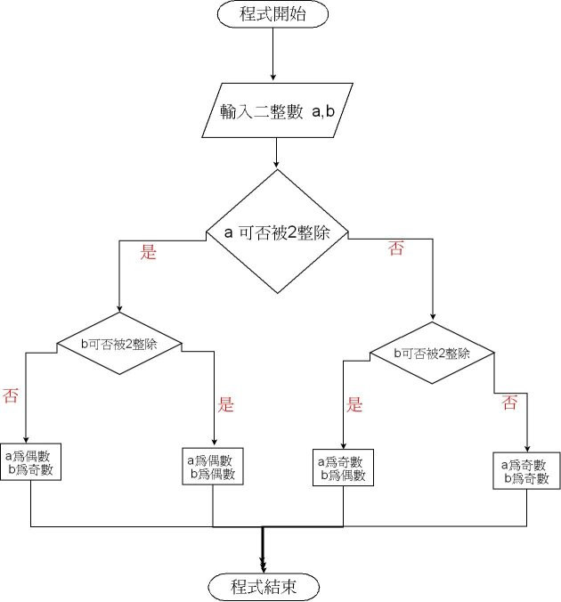
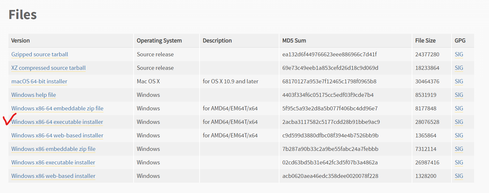
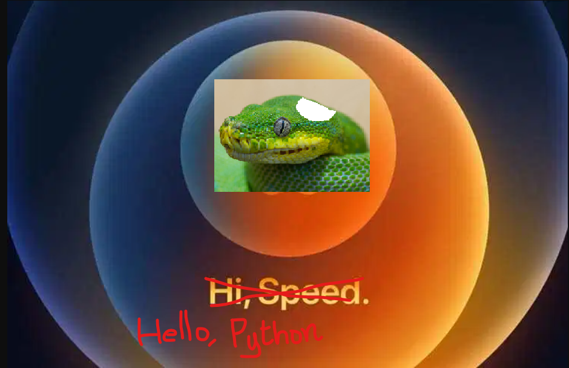

# Lecture 1 - Computational thinking / Python 安裝與開發環境介紹 / Hello World

## What the hell is computational thinking?
1. [什麼是「運算思維」？](https://medium.com/orangeapple/%E4%BB%80%E9%BA%BC%E6%98%AF-%E9%81%8B%E7%AE%97%E6%80%9D%E7%B6%AD-dbb763237e65)
2. [Wing Jeannette M 2008Computational thinking and thinking about computingPhil. Trans. R. Soc. A.3663717–3725](http://doi.org/10.1098/rsta.2008.0118)
3. [虛擬碼](https://michaelchen.tech/blog/how-to-write-pseudocode/) 
4. 流程圖
   
   

   程式流程圖
   


## Python 安裝與開發環境介紹
* 下載 Python: 
  
  如果是 MacOS，恭喜不需要額外裝，直接開啟終端機執行 python3進入Python世界。(難怪Macbook都這麼貴，呵呵)

  如果是 Windows，下載連結如下，下載後開啟exe安裝，努力地，用力地按下一步。
  
  https://www.python.org/downloads/release/python-386/
  
  
* 下載 Visual Studio Code: 他真的很好用，用了以後會覺得跟用唉鳳一樣，生活不能沒有他。

    https://code.visualstudio.com/

* 安裝 jupyter notebook: 顛覆傳統的 coding 環境。
  
  在終端機打
    ```
    pip install jupyter 或 pip3 install jupyter
    ```
    想知道 pip 跟 pip3 差在哪裡嗎? 那就認真上課囉。

* [Optional] Notepad++ + 終端機: 狂人專用。

    https://notepad-plus-plus.org/downloads/

* [Optional] Vim + 終端機: 神專用。
  
  https://www.vim.org/download.php

* [Optional] PyCharm: 也不錯用，只是有點肥大。
  
  https://www.jetbrains.com/pycharm/

## VS Code Extension
* https://marketplace.visualstudio.com/items?itemName=ms-python.python
* https://marketplace.visualstudio.com/items?itemName=ms-vscode-remote.remote-ssh-edit

## Hello World


https://zh.wikipedia.org/wiki/Hello_World

## Hacking Day
1. 
    https://drive.google.com/file/d/1D87Q_eCk0kOOhdPUq08miAm12jYme90N/view?usp=sharing

    

2. Chrome遊戲
   
   https://www.facebook.com/joao.v.tinti/videos/3132091896902957/

3. 模仿後門程式
   
   https://github.com/yanshuolee/Network-programming/tree/master/Command%20Line%20connection